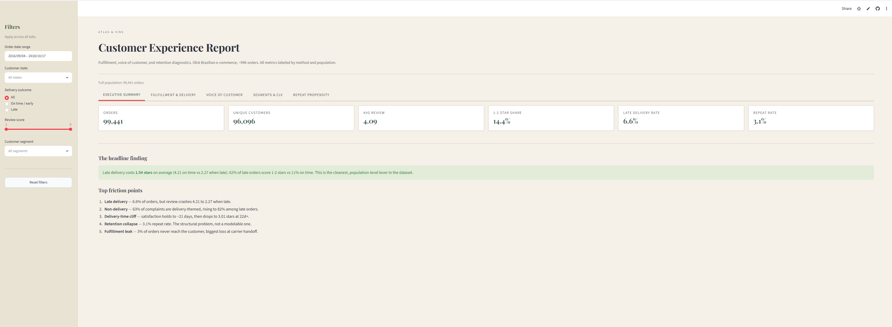

# Customer Experience Analytics — Atlas & Vine

**What makes a customer never come back?** An end-to-end CX analysis of 99,441 orders that figures out which problems are worth fixing and which ones no model can fix.

**[▶ Live dashboard](https://ecommerce-voc-insights.streamlit.app)**  ·  [📄 Business report (PDF)](reports/business_report.pdf)  ·  [📄 Case study (PDF)](reports/case_study.pdf)  ·  🎥 Walkthrough video *(coming soon)*

> Built on the [Olist Brazilian e-commerce dataset](https://www.kaggle.com/datasets/olistbr/brazilian-ecommerce). "Atlas & Vine" is a fictional fashion retailer used to frame the analysis. All monetary figures are in Brazilian reais (R$).

---

<!--
  HERO SCREENSHOT GOES HERE.
  Capture: the Executive Summary tab of the live dashboard with the
  "1.94-star delivery drop" metric card and a chart visible.
  Save it to assets/dashboard.png and replace the line below.
-->


---

## The problem

A mid-sized online fashion retailer is bleeding customers and nobody knows exactly where or why. Returns are up, repeat purchases are down, and support tickets are climbing. I was brought in to answer three questions: where do customers drop off, what frustrates them, and what should the business actually do about it.

The honest answer split in two:

- **Delivery is a real lever the business can pull.** It has a clean, measurable effect on satisfaction.
- **Retention is structural.** The repeat rate is so low that no per-customer targeting model can move it, and pretending otherwise would be dishonest.

## Key findings

**1. Late delivery is the single clearest satisfaction lever.**
On-time orders average a 4.21 review. Late orders crash to 2.27, a 1.94-star drop. 62.4% of late orders score 1 to 2 stars, versus 11.3% when on time. This holds across the full order population, not a sample.

**2. Satisfaction holds for three weeks, then cliffs.**
Reviews stay healthy up to ~21 days, then fall to 3.01 at 22 days or more. The damage isn't gradual, there's a clear breakpoint.

**3. ~3% of orders never reach the customer.**
2,965 orders (2.98%) drop out of the fulfillment funnel, with the biggest single leak at the carrier-handoff step (1,623 orders). Customers who paid and got nothing.

**4. Retention is structurally low.**
Only 3.12% of customers ever place a second order. 96.9% are one-and-done. This is the headline business problem, and it's bigger than delivery.

**5. First-order experience does not predict repeat purchase.**
A leakage-free repeat-purchase model (XGBoost, first-order features only) scored ROC-AUC 0.59, barely above random. This is a finding, not a failed model: the low score is trustworthy *because* the design was leakage-free, and it proves the low repeat rate is structural rather than something individual targeting could fix.

## What the dashboard shows

Five tabs, all recomputing live from global filters (date, state, delivery outcome, review score, segment):

- **Executive summary** — delivery satisfaction, retention reality, top friction points
- **Fulfillment funnel** — order placed → paid → shipped → delivered, with real drop-off
- **Voice of Customer** — complaint themes, topic clusters, sample reviews
- **Segments** — four behavioral customer groups with descriptive value
- **Repeat propensity** — the "experience doesn't predict repeat" finding, shown as a distribution, deliberately not a ranked at-risk list

## Methods (and where I was honest about limits)

This project leans hard on calling its own methods accurately. A few things didn't run as originally planned, and the README says so rather than hiding it:

| Layer | What was used | Note |
|---|---|---|
| Sentiment classifier | TF-IDF + Logistic Regression | 84% accuracy on held-out test |
| Theme classifier | TF-IDF + Logistic Regression | delivery F1 0.76; minority themes directional |
| Topic modeling | TF-IDF + K-means | BERTopic fell back (transformer backend was offline) |
| Emotion tagging | Rule-based keyword matching | DistilBERT fallback; directional only |
| Segmentation | K-means (k=4) | k chosen for business granularity over silhouette |
| Customer value | Descriptive CLV | predictive lifetime model not viable at 3% repeat |
| Repeat model | XGBoost, leakage-free | ROC-AUC 0.59 |

**Two caveats worth reading:**

- The 11,997-review complaint corpus was deliberately over-sampled toward negative reviews. It answers "what do people complain about," never "what fraction of customers are unhappy."
- The dashboard is interactive, not live. It recomputes in-memory from committed analytical datasets, it does not connect to a production database.

## Tech stack

Python, pandas, NumPy, scikit-learn, XGBoost, NLTK, spaCy, Streamlit, Plotly, weasyprint (report generation), Git/GitHub.

## Repository structure

```
cx-analytics-project/
├── data/processed/        cleaned parquets (master, scored reviews, segments)
├── data/labeled/          manually labeled training set
├── notebooks/             01 exploration → 08 repeat model
├── src/                   text_preprocessing.py and helpers
├── dashboard/app.py       the Streamlit dashboard
├── models/                pickled classifiers and repeat model
├── reports/               business report PDF, day summaries
└── README.md
```

## Run it locally

```bash
git clone https://github.com/akygtr/cx-analytics-project.git
cd cx-analytics-project
python -m venv venv && source venv/bin/activate   # Windows: venv\Scripts\activate
pip install -r requirements.txt
streamlit run dashboard/app.py
```

The notebooks in `notebooks/` reproduce the full pipeline in order, from raw data to the scored datasets the dashboard reads.

---

**Author:** Akshara · [GitHub](https://github.com/akygtr)
